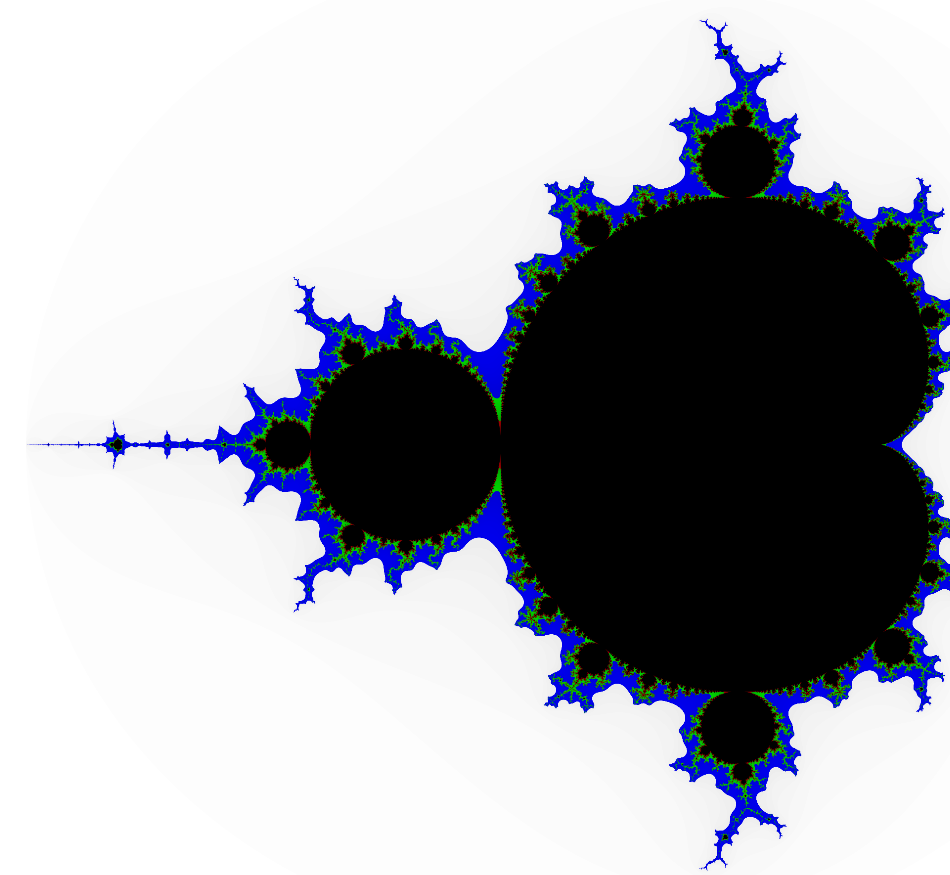
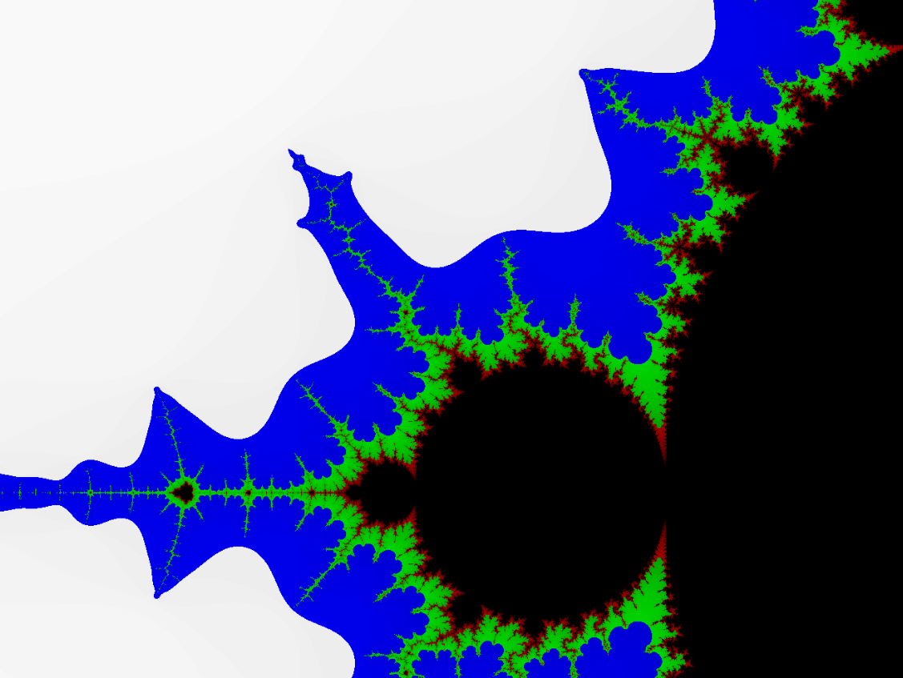
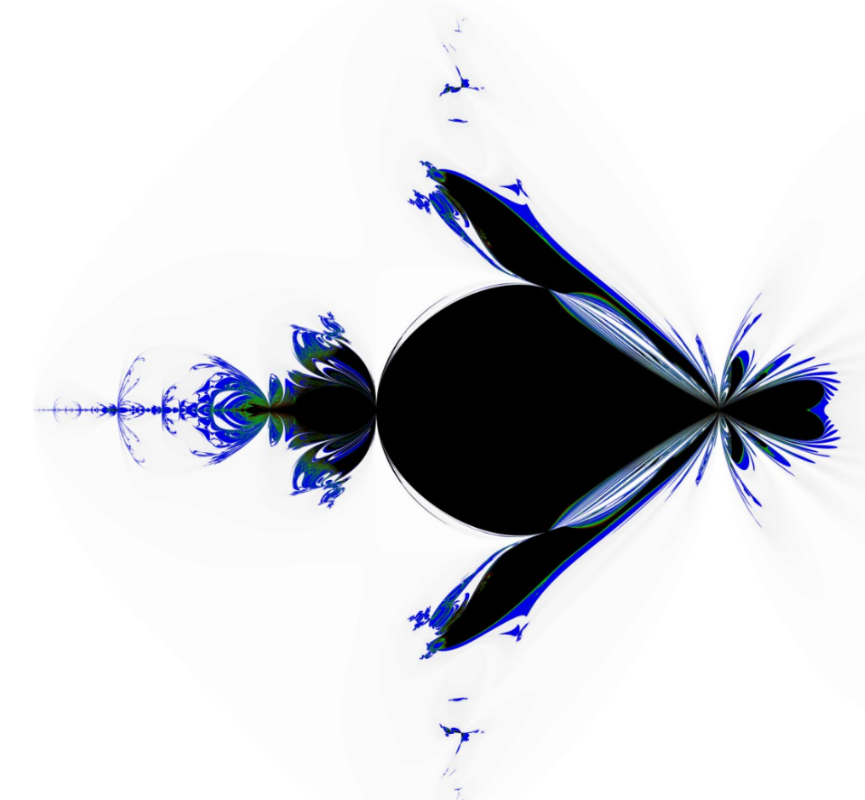
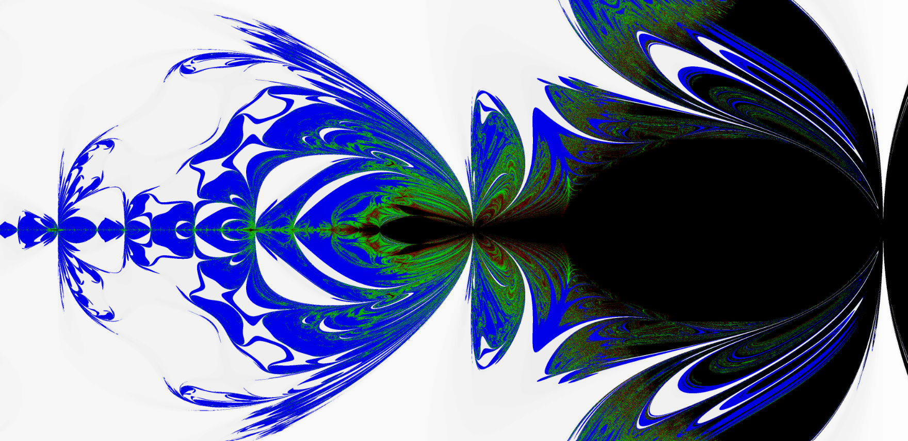
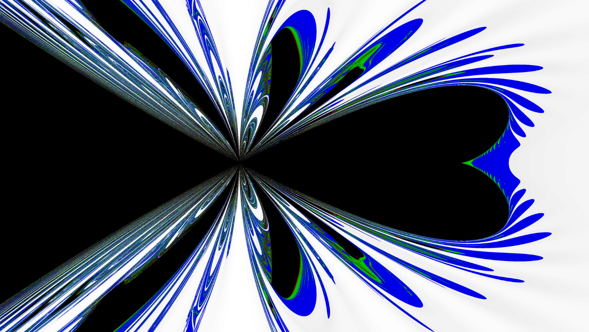
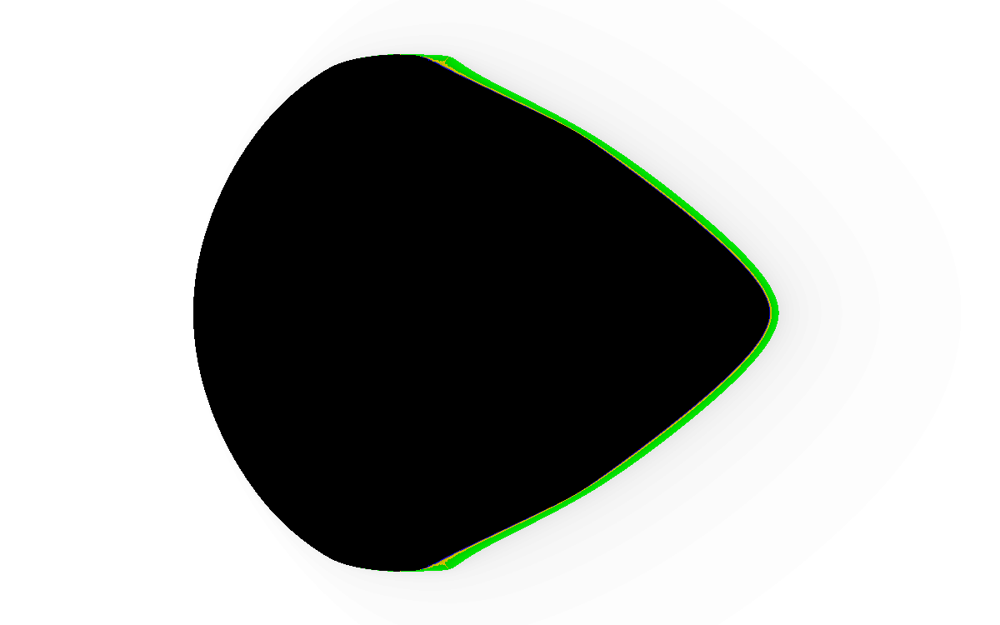
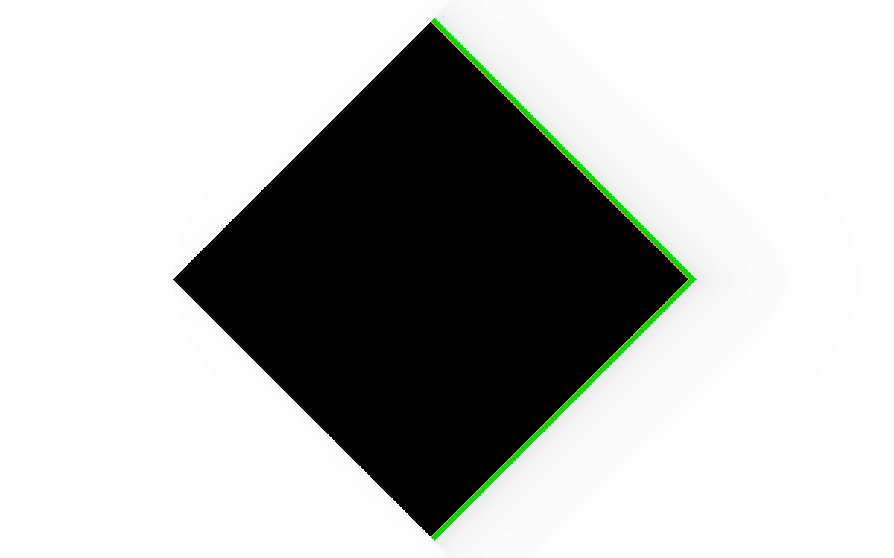
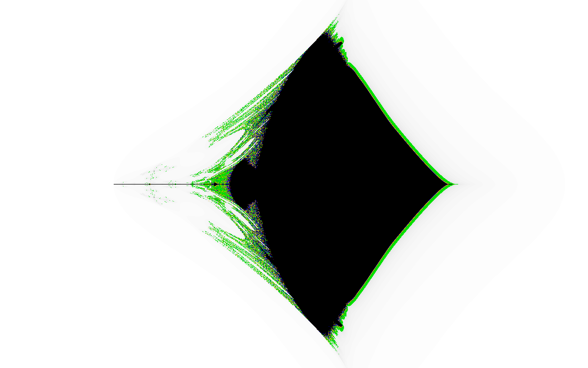
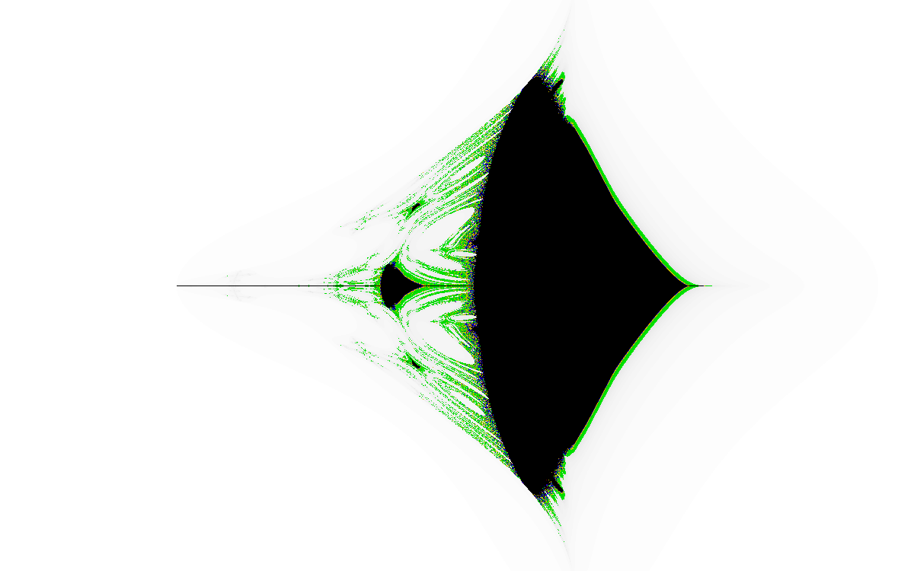
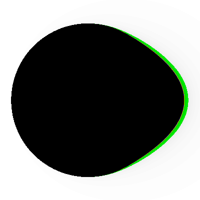

# 分形
老早之前就想着自己来研究下分形了  
一个普普通通的函数竟然能渲染出无限细分、无限复杂的图形  
真是个恐怖的世界啊  
参考自知乎https://www.zhihu.com/question/60051894  
自己加了点彩色渲染啊啥的  
之后也许会再整点别的  

### main_2.0.c
从[安卓版本](https://github.com/Small-Totem/Fractal_Android)弄过来了新的图形和渲染模式  
然后折腾了下用pthread实现了多线程渲染

### fractal_from_1.4.c
从安卓版本1.4弄过来的，把jni的部分删掉了  
顺手把之前的main.c和main2.0.c删了

***
  
  
  
  
  
  
  
  
  
  
